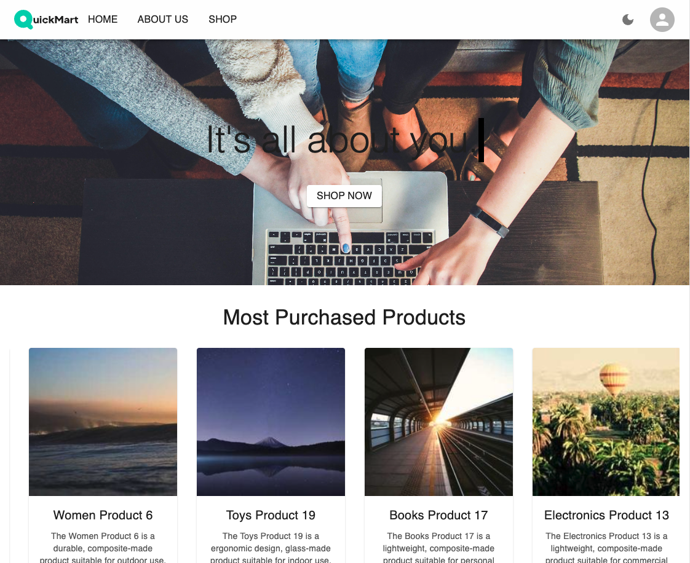
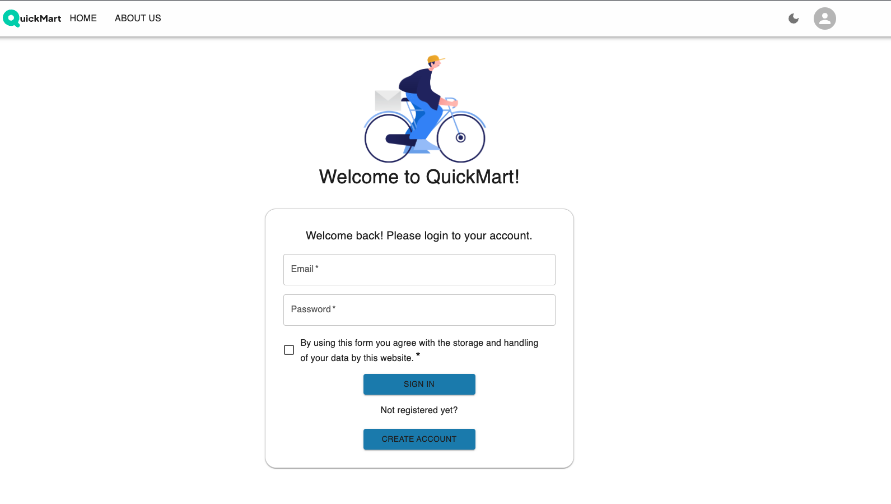
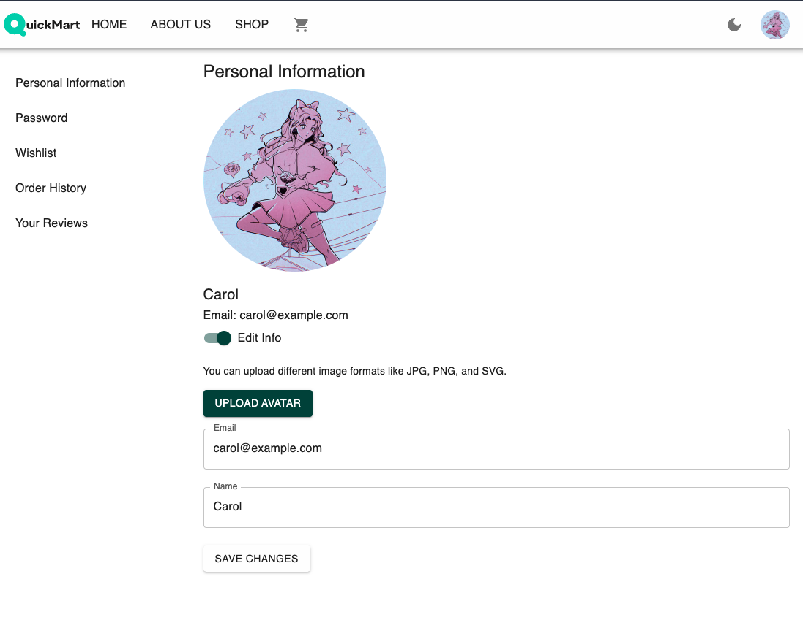
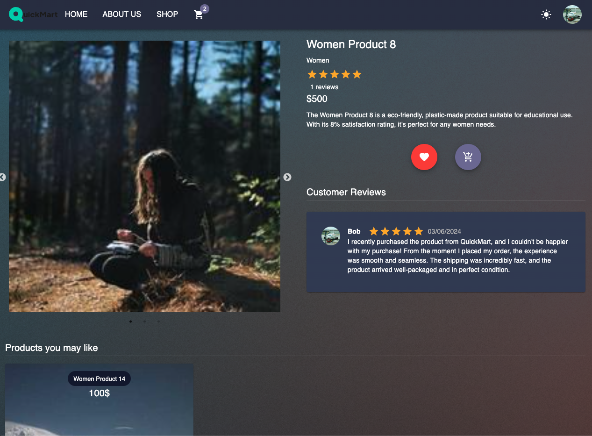
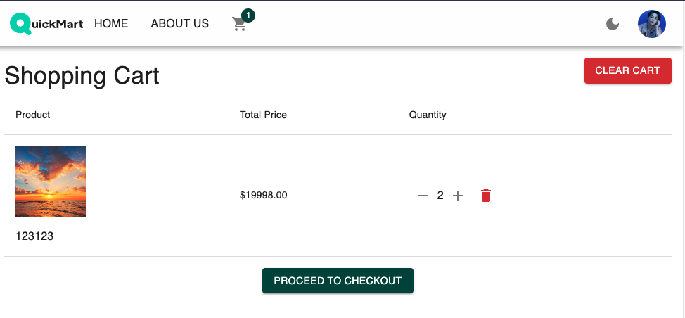
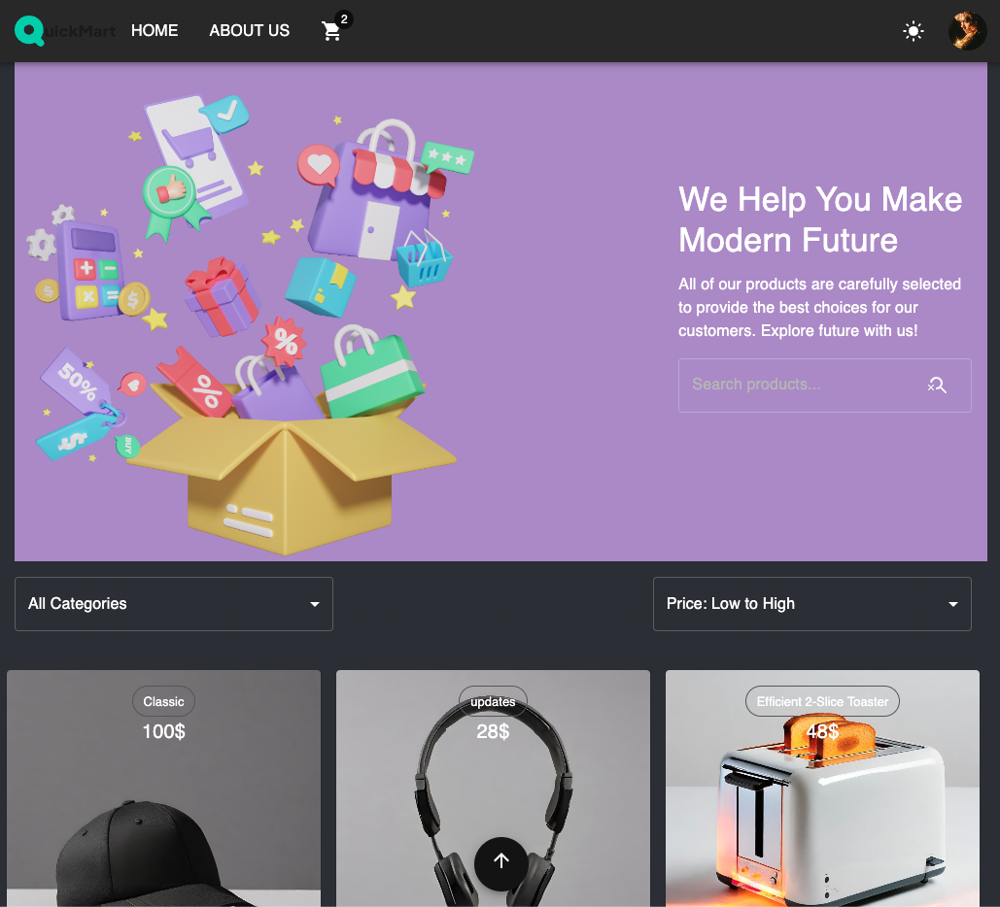
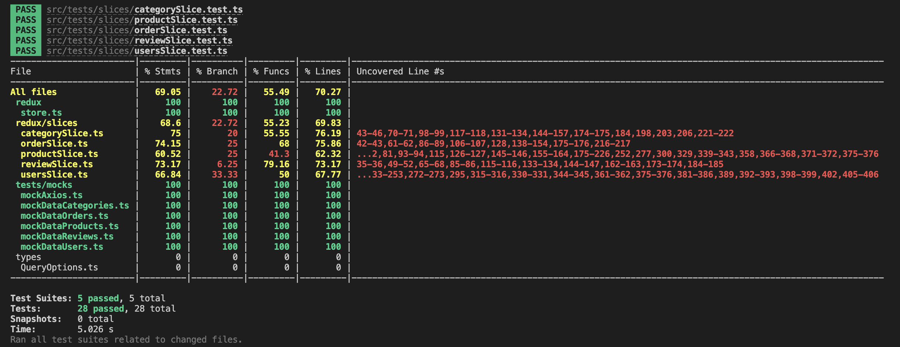
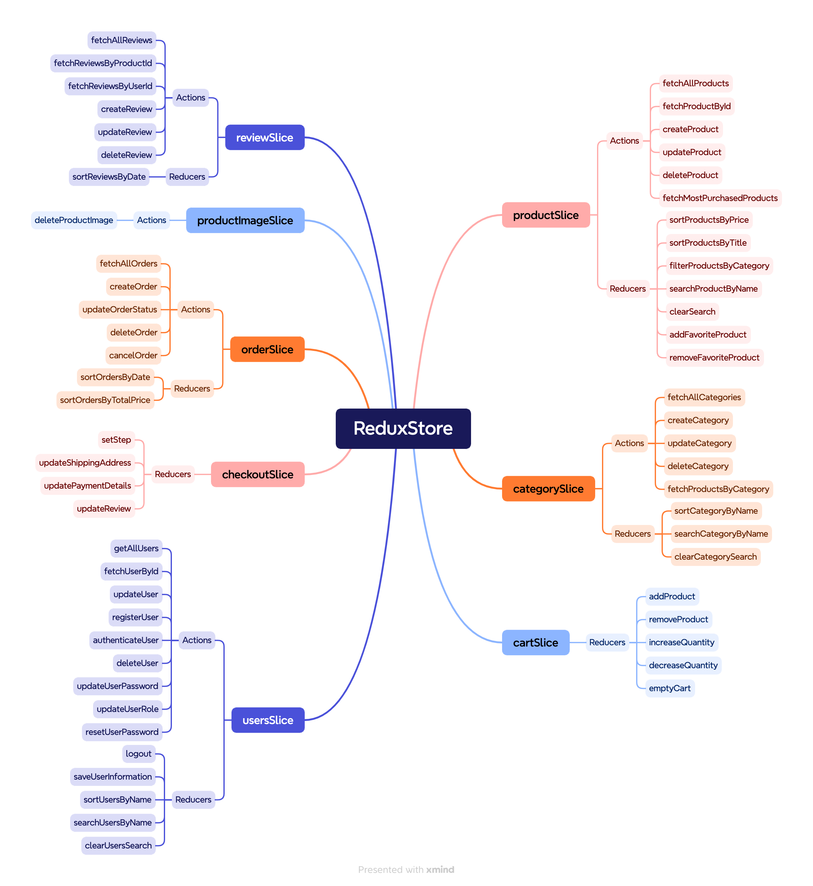

<p align="center">
  
</p>
<p align="center">
    <h1 align="center">Frontend E-Commerce Project</h1>
</p>
<p align="center">
		<em>Developed with the software and tools below.</em>
</p>
<p align="center">
	
	
  
  
  
  
  
</p>

# Frontend project - QuickMart

This repository for the Frontend project aimed at building an e-commerce website as part of the training program at [Integrify's Fullstack Developer program](https://www.integrify.io/program/finland/full-stack). The main purpose of this project is to create a user-friendly website where customers can easily explore, select, and purchase products online. Whether it's clothing, electronics, or any other items, our platform aims to cater to the needs of various shoppers by offering a smooth and intuitive shopping journey. Users can create orders, write and update reviews, and sort products based on different criteria. Admins have the ability to manage orders, users, products, and more, ensuring efficient control over the e-commerce operations. You can explore the live deployment of our frontend e-commerce project by visiting [QuickMartEcommerce](https://fs17-frontend-project.vercel.app/).

## Backend Repository

The backend repository for this project handles the server-side logic, database interactions, and API endpoints required to support the e-commerce functionalities. It is built using ASP.NET Core and follows the Clean Architecture principles to ensure maintainability and scalability.

You can find the backend repository at the following link: [QuickMartEcommerce Backend Repository]()

<details>
  <summary>🔗 Table of Contents</summary>

- [📷 App Screenshots](#-app-screenshots)
- [🚀 Getting Started](#-getting-started)
  - [⚙️ Install](#-install)
  - [► Using QuickMart](#-using-quickmart)
  - [🧪 Tests](#-tests)
- [📦 Features](#-features)
- [📂 Repository Structure](#-repository-structure)
- [🛠 Project Roadmap](#-project-roadmap)
  - [🔩 Redux Store Structure](#-redux-store-structure)
- [🌏 Deployment](#-deployment)
- [👏 Acknowledgments](#-acknowledgments)
</details>
<hr>

## 📷 App Screenshots









## 🚀 Getting Started

**_Requirements_**

Ensure you have the following dependencies installed on your system:

- **TypeScript**: `^4.9.5`
- **React**: `^18.2.0`

### ⚙️ Install

1. Clone the repository:

```sh
git clone https://github.com/VictoriiaShtyreva/fs17-Frontend-project
```

2. Change to the project directory:

```sh
cd fs17-Frontend-project
```

3. Install the dependencies:

```sh
npm install
```

### ► Using `QuickMart`

Use the following command to run QuickMart:

```sh
npm start
```

### 🧪 Tests

Use the following command to run tests:

```sh
npm test
```

Tests for this project are written using Jest, with the assistance of [msw](https://mswjs.io/) for mocking the server. The project utilizes three mock servers for handling products, categories, and users respectively. The tests are structured to cover various aspects of the application's functionality, including unit tests.



---

## 📦 Features

|     | Feature                                     | Description                                                                                                                                                                                                                                                                                                                                                                                                          |
| --- | ------------------------------------------- | -------------------------------------------------------------------------------------------------------------------------------------------------------------------------------------------------------------------------------------------------------------------------------------------------------------------------------------------------------------------------------------------------------------------- |
| ⚙️  | **Architecture**                            | This project is built using React, TypeScript, Redux Toolkit, and React Router Dom, following a structured architecture that includes components, screens, hooks. Context API is utilized for switching between light and dark themes, enhancing user experience and accessibility.                                                                                                                                  |
| 🔩  | **Use Context API to switch theme**         | The project leverages the Palette Mode feature from Material-UI and Context API to seamlessly switch between light and dark modes, providing users with a customizable and visually comfortable browsing experience.                                                                                                                                                                                                 |
| 📄  | **Incorporate scroll-to-top functionality** | The implementation of scroll-to-top functionality is achieved using [GSAP](https://gsap.com/), allowing users to effortlessly navigate back to the top of the page with smooth animations for enhanced user experience.                                                                                                                                                                                              |
| 🔌  | **Checkout Form**                           | The checkout form functionality is implemented using Redux reducers for logic and Material-UI for styling, ensuring a user-friendly and visually appealing checkout process.                                                                                                                                                                                                                                         |
| 🧩  | **Empty States**                            | Various empty states are implemented throughout the application, including empty cart, favorite products, error page, and no products found. These states provide clear feedback to users and enhance the overall user experience by guiding them effectively.                                                                                                                                                       |
| ⚡️ | **Performance & Optimisation**              | Performance and optimization techniques such as lazy loading, [React Hook Form](https://react-hook-form.com/) for validation, optimized data fetching with createAsyncThunk, useCallback, and memo are employed to ensure fast rendering, smooth user interactions, and efficient resource management, resulting in an optimized browsing experience.                                                                |
| 📦  | **Login user and Admin dashboard**          | The project features user authentication functionality, allowing users to log in and access their user page where they can update their information such as email and name. Additionally, an admin dashboard is available for admins to create, update, and delete products, providing enhanced control over product management. As admin user can login using `email`: "alice@example.com", `password`: "alice@123" |

## 📂 Repository Structure

```sh
src
   |-- App.test.tsx
   |-- App.tsx
   |-- components
   |   |-- ProtectedRoute.tsx
   |   |-- ScrollToTopButton.tsx
   |   |-- admin
   |   |   |-- AdminDashboard.tsx
   |   |   |-- AdminSortingFilter.tsx
   |   |   |-- CategoriesListDashboard.tsx
   |   |   |-- OrdersListDashboard.tsx
   |   |   |-- ProductAdminItem.tsx
   |   |   |-- ProductCreateForm.tsx
   |   |   |-- ProductListDashboard.tsx
   |   |   |-- UpdateProduct.tsx
   |   |   |-- UserListDashboard.tsx
   |   |-- cart
   |   |   |-- CartItem.tsx
   |   |   |-- CartModal.tsx
   |   |   |-- EmptyCart.tsx
   |   |   |-- checkout
   |   |   |   |-- AddressForm.tsx
   |   |   |   |-- CheckoutForm.tsx
   |   |   |   |-- PaymentForm.tsx
   |   |   |   |-- Review.tsx
   |   |-- contextAPI
   |   |   |-- ColorThemeContext.tsx
   |   |   |-- theme
   |   |   |   |-- customTheme.ts
   |   |-- footer
   |   |   |-- Footer.tsx
   |   |-- header
   |   |   |-- Header.tsx
   |   |-- orders
   |   |   |-- OrdersSorting.tsx
   |   |-- products
   |   |   |-- CategorySelection.tsx
   |   |   |-- EmptyFavoritesProducts.tsx
   |   |   |-- EmptyProducts.tsx
   |   |   |-- MostPurchasedProducts.tsx
   |   |   |-- ProductCard.tsx
   |   |   |-- ProductDetails.tsx
   |   |   |-- ProductList.tsx
   |   |   |-- Products.tsx
   |   |   |-- SearchForm.tsx
   |   |   |-- SortingFilter.tsx
   |   |-- user
   |   |   |-- OrderHistory.tsx
   |   |   |-- RegisterUserModal.tsx
   |   |   |-- ReviewCreateModal.tsx
   |   |   |-- ReviewEditModal.tsx
   |   |   |-- ReviewHistory.tsx
   |   |   |-- UserAccount.tsx
   |-- hooks
   |   |-- useAppDispach.ts
   |   |-- useAppSelector.ts
   |-- images
   |   |-- EmptyCart.svg
   |   |-- EmptyFavoriteProduct.svg
   |   |-- NoProductsFound.svg
   |   |-- NotFoundPage.svg
   |   |-- homepage.jpg
   |   |-- homepicture.png
   |   |-- loginpage.png
   |   |-- logo.svg
   |-- index.css
   |-- index.tsx
   |-- pages
   |   |-- AboutUs.tsx
   |   |-- AdminPage.tsx
   |   |-- CartPage.tsx
   |   |-- HomePage.tsx
   |   |-- LoadingPage.tsx
   |   |-- LoginPage.tsx
   |   |-- NotFoundPage.tsx
   |   |-- ShopPage.tsx
   |   |-- SingleProductPage.tsx
   |   |-- UserPage.tsx
   |-- react-app-env.d.ts
   |-- redux
   |   |-- slices
   |   |   |-- cartSlice.ts
   |   |   |-- categorySlice.ts
   |   |   |-- checkoutSlice.ts
   |   |   |-- orderSlice.ts
   |   |   |-- productImageSlice.ts
   |   |   |-- productSlice.ts
   |   |   |-- reviewSlice.ts
   |   |   |-- usersSlice.ts
   |   |-- store.ts
   |-- reportWebVitals.ts
   |-- setupTests.ts
   |-- types
   |   |-- Authentication.ts
   |   |-- Category.ts
   |   |-- Checkout.ts
   |   |-- ColorThemeChange.ts
   |   |-- Order.ts
   |   |-- Product.ts
   |   |-- QueryOptions.ts
   |   |-- Review.ts
   |   |-- ShoppingCart.ts
   |   |-- User.ts
   |   |-- type.ts
   |-- utils
   |   |-- checkImageUrl.ts
   |   |-- scrollToTop.ts
   |   |-- svgUrl.ts

```

---

## 🛠 Project Roadmap

### 🔩 Redux Store Structure



## 🌏 Deployment

To deploy the project was used [Vercel](https://vercel.com/docs/getting-started-with-vercel/template).

## 👏 Acknowledgments

- With sincere gratitude to the team at [Integrify](https://www.integrify.io/) for their unwavering support and knowledge. Their guidance and resources have been instrumental in the development of this project.

[**Return**](#-app-screenshots)
